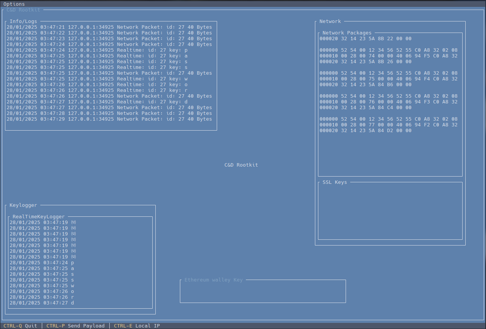
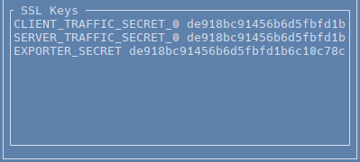
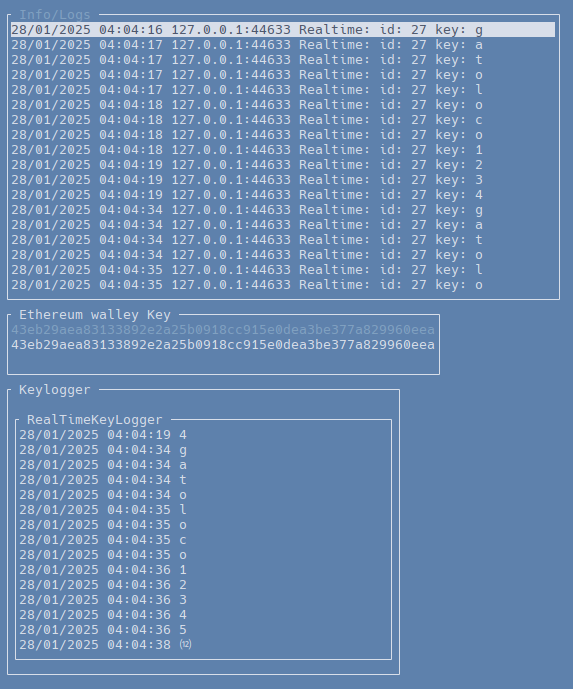
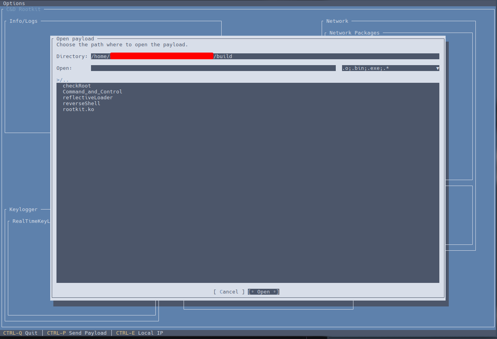
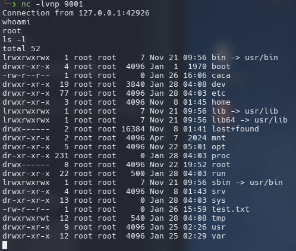

# Academic linux rootkit with a Command & Control


<p align="center">

</p>
<h2 style="text-align:center;">This is an academic rootkit, as a final degree project.</h2>

## 🔍​ Features

-   Keylogger.
-   An in memory binary loader with super user permissions that can run a payload sent from Command & Control.
-   Sniffing, capturing network packets and sending them to Command & Control.
-   Capture TLS encryption keys from the browser and send them to Command & Control.
-   Hijacking system calls to hide the rootkit.
-   Privilege escalation using a device in /dev
-   Proof of concept of how to sniff information from the process memory.

    -   This proof of concept consists on stealing a private key from an ethereum wallet (InifityWallet)

## 📝 Requirements

The following packages are required to compile:

-   makefile
-   build-essential
-   kernel headers
-   dotnet-sdk

## ⚙️ Configuring

-   To compile the project it is necessary to specify the full path of the `reflectiveLoader` file in `binaryBlob.S` as shown in the block below.

```
.incbin "/xxxx/xxxx/xxxx/Rootkit/build/reflectiveLoader"
```

-   To configure which functions will be available, edit the variables in the `/src/main.c` file.

```
#define verbose 0

#define keylogger 1 /*Requiere sendNetworkPackets*/ /*Requiere socket*/
#define binatyLoader 1
#define SSLKeys 1 /*Requiere charRoot*/ /*Requiere socket*/
#define charRoot 1 /* Char device*/
#define sendNetworkPackets 1
#define networkCC 1 /* Network socket*/
#define hideDentry 1 /* Hiding you in the file system */
#define hideModuleList 1 /* Hides you from the list of kernel modules (but can't be unloaded) */
#define pocInifinityWallet 1
```

-   To use qemu in a simple way you will also have to configure the config.sh file and then load it with `source ./config.sh`

```
hardDisk="path to linux qemu disk"
```

## 🚀 Building

-   Running make all will compile and copy al the binary files in the /build folder.
    these files are:
    * **_CheckRoot_** -> This program checks that it is running in root mode.
    * **_Command_and_Control_** -> Command & Control binary.
    * **_reflectiveLoader_** -> this program loads a payload that was sent from the command and control.
    * **_reverseShell_** -> This program opens a reverse shell that can be listened from netcat program.
    * **_roortkit.ko_** -> The roorkit kernel module file.
-   Running make also will copy some files to /qemu/isshared (this folder is shared between the virtual machine and host)
    -   **_load.sh_** -> This script simulates a rootkit loading.
    -   **_rootkit.ko_** -> The roorkit kernel module file.
-   Running make clean will delete all compiled files.
-   You can also compile the different components, such as the tools or Command & Control. For that see the makefile

## 💻​ How to use

-   First run the Command & Control .

-   A script is included to simulate the rootkit kernel module load, the first load implants the persistence in the system and the patches for the systemd variables so all the child processes export the ssl keys.

-   Next, the session must be closed, to simulate a kernel module load with persistence. This also activates all the other functions.

The script is guided in this process.

The `config.sh` file allows to launch a qemu virtual machine in a simpler way (with the configuration in a single command).

The Command & Control generates files to store the data received from the rootkit. **_there are example files_**

-   **_keyLogger.txt_**
-   **_log.txt_**
-   **_networkData.txt_**
-   **_SSLKEYLOGFILE.txt_**
-   **_ethereumPrivateKey.txt_**

To convert the data packets to .pcap files use the command

```
cat xx.x.xxxx_networkData.txt | text2pcap - dump.pcap
```

To create a server for the reverse shell use the following command.

```
nc -lvnp 9001
```

## 📷​​ Screen Shots

</p>
<p style="text-align:center;">Command & Control main window</p>
<p align="center">


</p>
<p style="text-align:center;">SSL firefox keys</p>
<p align="center">


</p>
<p style="text-align:center;">Ethereum private key whit wallet password "gatoloco12345"</p>
<p align="center">


</p>
<p style="text-align:center;">Ethereum private key InfinityWallet</p>
<p align="center">


</p>
<p style="text-align:center;">Send payload</p>
<p align="center">


</p>
<p style="text-align:center;">Reverse Shell Netcat (you can see the root user with whoami command) </p>
<p align="center">


## License

[GPLv3](https://opensource.org/licenses/)
